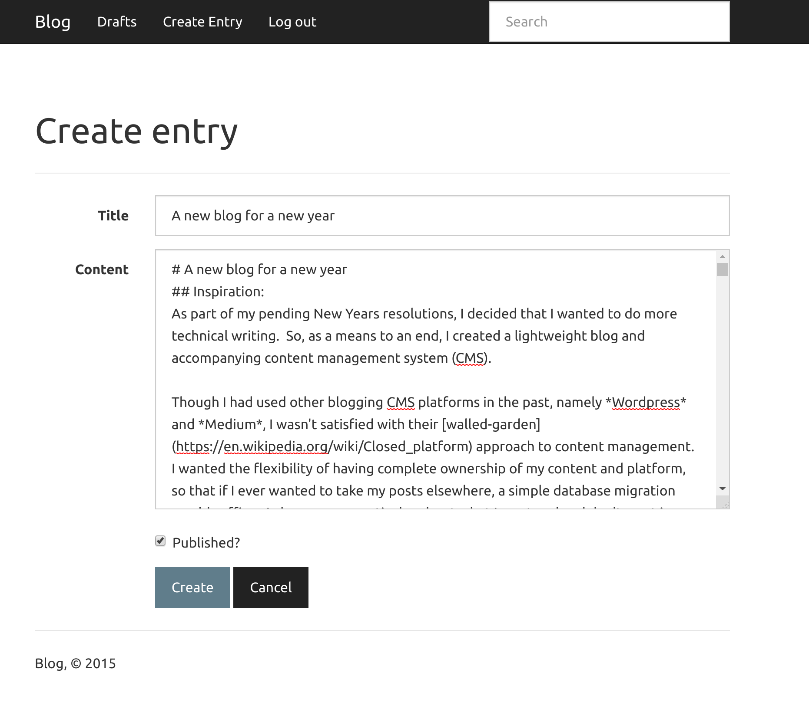
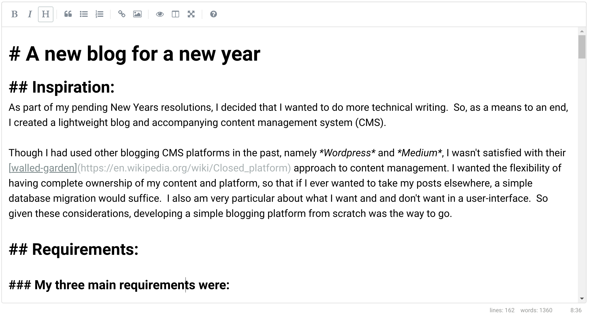
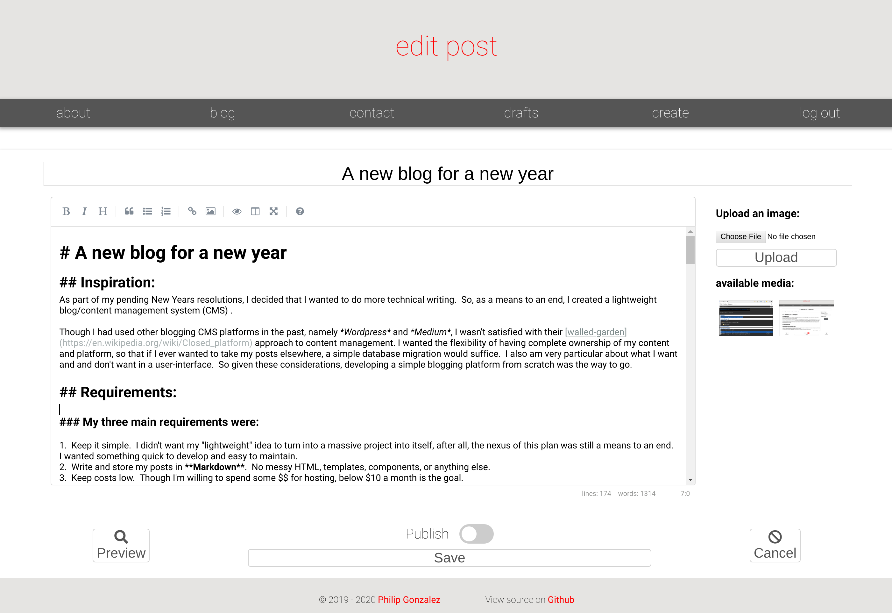

As part of my pending New Years resolutions, I decided that I wanted to do more technical writing.  So, as a means to an end, I created a lightweight blog and accompanying content management system (CMS).

Though I had used other blogging CMS platforms in the past, namely *Wordpress* and *Medium*, I wasn't satisfied with their [walled-garden](https://en.wikipedia.org/wiki/Closed_platform) approach to content management. I wanted the flexibility of having complete ownership of my content and platform, so that if I ever wanted to take my posts elsewhere, a simple database migration would suffice.  I also am very particular about what I want and and don't want in a user-interface.  So given these considerations, developing a simple blogging platform from scratch was the way to go.

## Requirements:

### My three main requirements were:

1.  Keep it **simple**.  I didn't want my "lightweight" idea to turn into a massive project into itself, after all, the nexus of this plan was still a means to an end.  I wanted something quick to develop and easy to maintain.
2.  Write and store my posts in **Markdown**.  No messy HTML, templates, components, or anything else. 
3.  Keep **costs low**.  Though I'm willing to spend some money for hosting, below $10 a month is the goal.

### Additionally, I wanted:

- Image uploading.  I want to be able to "add an Image" on the fly to my posts without using an external service like *Imgur*.
- Built-in `syntax highlighting`.  This was going to to be a technical blog after all.
- The ability to drop into HTML when necessary.  Though I originally said that I don't want the "messiness" of HTML, I want to be able to use it directly in my markdown when aboslutely needed.

## Considerations:

Given that I was going to create my own CMS, I wanted the stack to be something that I enjoyed working in.  My original thought was to use **Node.js**, to connect to **PostgreSQL** and serve a **React/Vue** front-end.  Though I quickly pivoted from this idea after reminding myself of the lackluster ORM support in JavaScript.  Okay, what language has my favorite ORM?  Why Python's [SQLAlchemy](https://www.sqlalchemy.org/) of course!

Okay, so my back-end is going to be Python, so I'll still serve up that **React/Vue** app from Flask server.  Though switching the back-end to Python got me thinking, do I really want the blog to be a single page application (SPA)?  In my experience SPAs can be notoriously slow in comparison to small server-side rendered templates.  And given that my application was going to be a blog, *I really didn't need* most of the overhead of what a "web application" provides.  Users need to be able to read my posts, I need to be able to upload my content.  Seems like a good candidate for good old-fashioned [web forms](https://developer.mozilla.org/en-US/docs/Learn/Forms/Your_first_form#The_%3Clabel%3E_%3Cinput%3E_and_%3Ctextarea%3E_elements) to me.  And as an added bonus, I don't need to create a modern API, I just need to handle a few simple **GET** and **POST** requests.  Score!

To recap, the app will run a **Flask** server and a **PostgreSQL** back-end.  I *wont* be using any modern JavaScript frameworks, any JavaScript that I need will be vanilla ES6 or something more old-school like **JQuery**.  As for styling and responsiveness, I'm a big fan of custom CSS Flexbox, so I'll be using that.  

## Implementation:

### Not starting from scratch:

To begin, I took to a bit of searching to see if someone had already made a similar tool.  Why reinvent the wheel?  Low and behold, I came across an [example blog repository](https://github.com/coleifer/peewee/tree/master/examples/blog) from the makers of the [peewee](http://docs.peewee-orm.com/en/latest/) ORM.



#### For my needs, it had a lot going for it:

1.  A fully-functional CMS blogging implementation **using Markdown**
2.  Handles **user sessions**
3.  Converts Markdown to HTML with gorgeous **syntax highlighting**
4.  A **tiny**, bare-bones implementation, with lots of room for customization

#### But it also had a couple of strings attached:

1.  Not using SQLAlchemy or Postgres `¯\_(ツ)_/¯`
2.  Using **Bootstrap** (*boo*)


### Adding a proper User table:

Originally, there was a hard-coded admin user being validated like so:

```python
ADMIN_PASSWORD = 'secret'

...

if password == app.config['ADMIN_PASSWORD']:
	session['logged_in'] = True
	session.permanent = True  # Use cookie to store session.
```

Even for a simple blog like this one, plaintext passwords make me a bit squeamish.  So after swapping out peewee and sqlite3 for SQLAlchemy and Postgres, I implemented a User class, with proper password salting and hashing:

```python
...
from werkzeug.security import generate_password_hash, check_password_hash
from sqlalchemy.orm.exc import NoResultFound
from main import db

class User(db.Model):
    id = db.Column(db.Integer, primary_key=True)
    username = db.Column(db.String(150), unique=True)
    password_hash = db.Column(db.String(128))

    def __init__(self, username, password):
        self.username = username.lower()
        self.set_password(password)
    
    def set_password(self, password):
        self.password_hash = generate_password_hash(password)

    def check_password(self, password):
        return check_password_hash(self.password_hash, password)

    @classmethod
    def get(cls, username):
        try:
            return User.query.filter(User.username == username.lower()).one()
        except NoResultFound:
            return None
```

Which allows us to log in like so:

```python
# inside of a request:
username = request.form.get('username')
password = request.form.get('password')
user = User.get(username)
if user and user.check_password(password):
	session['logged_in'] = True
	session['user_id'] = user.id
	session.permanent = True  # Use cookie to store session.
```

### Adding a few more tables:

After implementing the Post and User tables, I added a few more:

-  `Image`
-  `Comment`
-  `Tag`
-  `PostTag` (Tags and Posts have a many-to-many relationship)

## Using a beautiful Markdown editor:

The original codebase was using a simple  `<textarea/>` for editing content.  My original thought was to add in an [AceEditor](https://ace.c9.io/kitchen-sink.html?doc=Markdown) instance to provide some Markdown syntax highlighting, that was until I stumbled across the glory that is  [SimpleMDE Markdown Editor](https://simplemde.com/).

The editor, which supports HTML previewing *as you type* in addition to a number of other useful features looks like this in it's most basic form:



## Image uploads

This was the fun part.  One of my requirements for this project was to be able to upload and incorporate images without leaving the editor.  I chose to use an **S3 Bucket** for this due to the [incredibly low costs](https://aws.amazon.com/s3/pricing/).

The implementation ended up being fairly simple.  My `Image` class had three columns, it's own `id`, the associated `post_id`, and the public `location` at which the image is actually hosted on S3.  With this in place, all we had to do is upload the image to S3, and then create an entry in our `Image` table.

```python

# inside of a request:
file = request.files['file'] # get a file from a form post
if file and allowed_file(file.filename): # ensure the file is an allowed image type (.jpeg` .gif, .png)
	filename = secure_filename(file.filename) #  https://werkzeug.palletsprojects.com/en/0.16.x/utils/#werkzeug.utils.secure_filename
	s3_bucket.put_object(Key=f'{post.slug}/{filename}', Body=file, ACL='public-read') # upload image to AWS
	new_image = Image(post.id, f'{os.environ["AWS_BUCKET_URL"]}/{post.slug}/{filename}')
	new_image.save()
```

With the `Post` class then updated to have a a one-to-many relationship with the images associated with it, (`images = db.relationship("Image")`), we can display the images associated with each post in the editor like so:

```html
<div class=image-thumbnails>
	
		
	
</div>
```

The end result looks like this:



## Styling and Scripting:

### Flexbox for all:

After removing Bootstrap, I styled the app by-hand with two main CSS files, one for the base, and another for mobile.  Opting to use Flexblox for most dynamic `<div />` elements was relatively painless.  I had never used a css *file* that activated with a media query before, but it's very easy to implement in HTML:

```html
<link rel=stylesheet type=text/css href="{{ url_for('static', filename='css/blog.css') }}" />
<link rel="stylesheet" media="screen and (max-width: 650px)" href="{{ url_for('static', filename='css/mobile-blog.css') }}" />
```

### Going old-school with `JQuery`:

Up unto this point I had almost written no JavaScript! 😲  To be sure, there was JavaScript living on my site in the form of SimpleMDE, but other than that, most everything else was server-rendered.  

`//todo`

## Reflections on \*NOT\* using a modern SPA framework in 2020:

`//todo`


## Caveats:

Using web forms (and no AJAX) for this project has not been without its limitations.  

`//todo`

## Next Steps:
- Tagging and commenting
`//todo`


