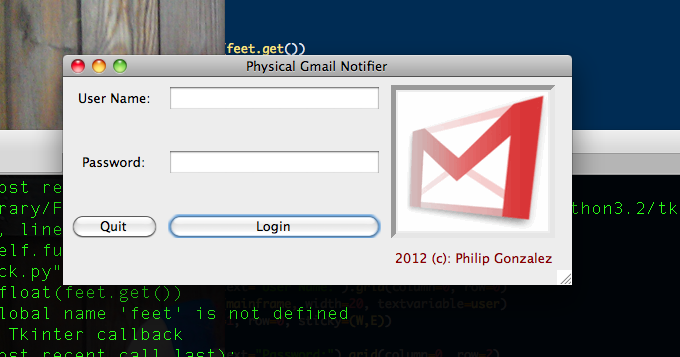

<span style="text-decoration: underline">**Authors Note**</span>:  I developed the Physical Gmail Notifier shortly after teaching myself Python and C++ in 2012.  This was one of my first engineering projects, and in many places (particularly the serial communication), I do not use best practices.  Though I am still proud of the end result, my then lack of programing experience shows in the code examples below.

The Physical Gmail Notifier is an IoT device and accompanying app that alerts a user when a new message arrives in their inbox. The flag on the side of the mailbox raises and lowers at a 90° angles and the screen illuminates when a new message arrives. The screen displays the login information and the total number of new messages. The mailbox can be programed to respond only to specific gmail labels or filters.

The mailbox was built using the [Arduino](https://arduino.cc) Uno microcontroller and several off-the-shelf hardware components.  The flag of the mailbox is raised and lowered using a **miniature servo motor**, user information is displayed using a 16x2 character **LCD display**, and a single button on the side of the device is used for user interaction.

The microcontroller was programed in the Arduino language (essentially C++ with some domain-specific libraries).

There is also an accompanying OSX application used to log into Gmail and communicate with the microcontroller over **serial communication**.



The OSX application was written in Python 2 using [Tkinter](https://python.readthedocs.io/en/v2.7.2/library/tkinter.html) for the GUI and [imaplib](https://docs.python.org/2/library/imaplib.html) to establish a connection with the Google's servers. It uses [PySerial](https://pypi.org/project/pyserial/) to communicate with the Arduino over a serial channel.

#### Python:
```python
conn = imaplib.IMAP4_SSL("imap.gmail.com", 993)
...
conn.login(user.get(),password.get())
setup()
send_username = user.get() + ">"
ser.write(send_username.encode('utf-8'))
```

It sends a `>` character as a termination identifier, that the Arduino looks for to identify the user's email address.

#### Arduino:
```cpp
while (Serial.available())
{
  delay(10);
  char c = Serial.read();

  if (c == ',')
  {
    break;
  }

  if (c == '>')
  {
    user = readString;
    readString = "";
    Serial.println(user);
    break;
  }

  readString += c;   

  ...

}
```

Using a 10ms delay, the Arduino reads each 8-bit `char` coming over the serial connection and concatenates them onto a `Arduino::String` until it reads a `,` or a `>`.  (**It would have been better to use a null-terminating character here**, and this is one of the places where my then lack of programing experience shows).

The Python application is polling Gmail every three seconds and updating the microcontroller via serial:

#### Python:

```python
if previous_unread_count < unread_count and previous_unread_count != 0:
    ser.write("One more,".encode('utf-8'))
if unread_count > 0:
    ser.write("{},".format(unread_count).encode('utf-8'))
else:
    ser.write("No,".encode('utf-8'))
```

Here the code will send the string `One more` if a new email has arrived since starting the Python application. It will also either send the total number of unread messages as a string or `No` if the inbox is empty.

#### Arduino:

```cpp
// ints to represent the servo angle
// for 'up' and 'down' flag positions
int up = 95;
int down = 7; 

while (Serial.available())
{

  ...

  // No messages, flag is down
  if (readString == "No")
  {
    flag.write(down);
    line1 = user + ":";
    line2 = readString + " new messages.";
  }
  // A new message since login, flag down and back up
  else if (readString == "One more")
  {
    flag.write(down);
    delay(700);
    flag.write(up);
  }
  // Inbox has messages on login
  else
  {
    flag.write(up);
    line1 = user + ":";
    line2 = readString + " new messages!";
  }

  // Write the Arduino::String values to the lcd screen.
  lcd.setCursor(0,0);
  lcd.print(line1);
  lcd.setCursor(0,1);
  lcd.print(line2);
}
```

The Arduino receives the char commands over the serial port, adjusts the flag's position, and writes user information to the LCD display.


##### The full project source is available on [Github](https://github.com/p-gonzo/physical-gmail-notifier).